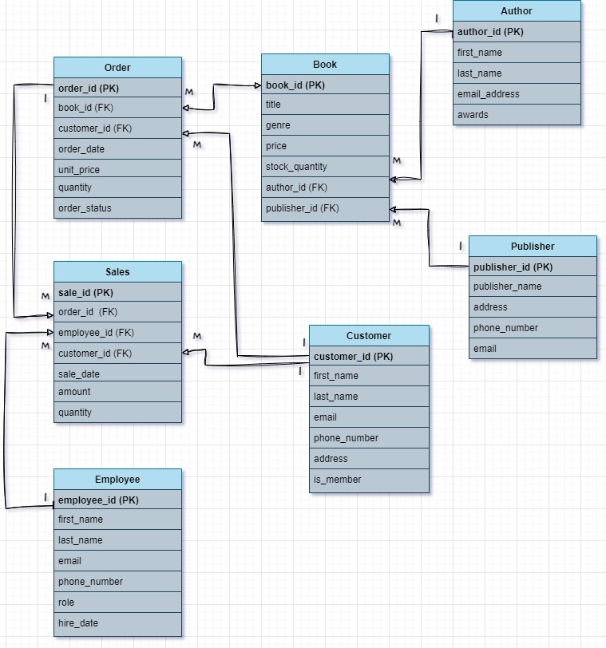
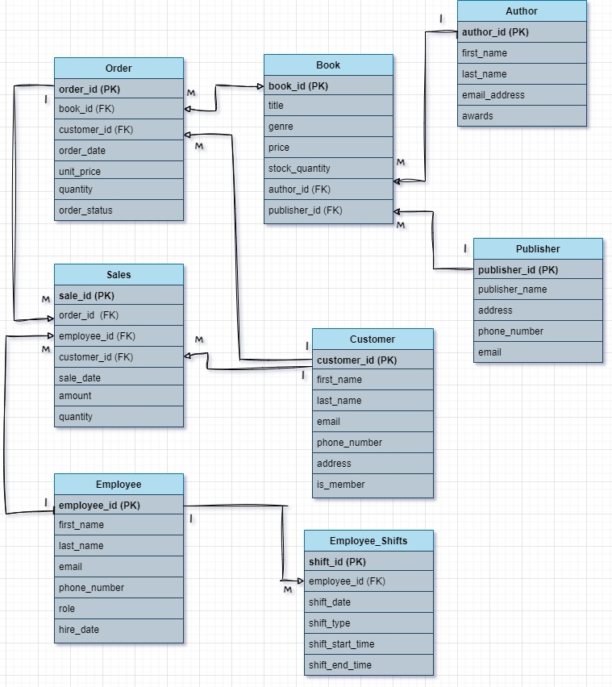

# Assignment 1: Design a Logical Model

## Question 1
Create a logical model for a small bookstore. 📚

At the minimum it should have employee, order, sales, customer, and book entities (tables). Determine sensible column and table design based on what you know about these concepts. Keep it simple, but work out sensible relationships to keep tables reasonably sized. Include a date table. There are several tools online you can use, I'd recommend [_Draw.io_](https://www.drawio.com/) or [_LucidChart_](https://www.lucidchart.com/pages/).

                                      Bookstore ERD

 


## Question 2
We want to create employee shifts, splitting up the day into morning and evening. Add this to the ERD.

                                      Bookstore with Employee Shifts 

 


## Question 3
The store wants to keep customer addresses. Propose two architectures for the CUSTOMER_ADDRESS table, one that will retain changes, and another that will overwrite. Which is type 1, which is type 2?

_Hint, search type 1 vs type 2 slowly changing dimensions._

Bonus: Are there privacy implications to this, why or why not?
```
Answer... 

1. **Overwriting Changes (Type 1 Slowly Changing Dimension)**
Table Name: CUSTOMER_ADDRESS

Columns:

customer_id (Primary Key)
unit_number
street
city
province
zip_code
country

In this setup, whenever a customer’s address is updated, the system simply overwrites the old address with the new one. There's no record of the previous addresses.

The table always shows the most up-to-date information.

**Type:** This is a Type 1 Slowly Changing Dimension, where changes overwrite old data and no history is kept.

2. Retaining Changes (Type 2 Slowly Changing Dimension)
Table Name: CUSTOMER_ADDRESS_HISTORY

Columns:

customer_id (Primary Key)
unit_number
street
city
province
zip_code
country
start_date (When the address became valid)
end_date (When the address stopped being valid, or NULL if it’s still active)
is_current (A flag to show if this is the most recent address)

In this approach, every time a customer’s address changes, a new row is added with the updated details. The old address is kept, but it's marked as inactive with an end_date and is_current = False.

This table shows all the past addresses of a customer.

**Type:** This is a Type 2 Slowly Changing Dimension, where changes are tracked by adding new rows, preserving the history.

**Privacy Implications**
Type 1 (Overwriting Changes):

**Privacy Concerns:** Since the old address gets overwritten, the system only keeps the latest information. This means less data is stored, but it can be an issue if someone makes a mistake or an unauthorized change because there's no way to see what the previous address was. Overall, it has fewer privacy concerns since there’s no history being saved.

Type 2 (Retaining Changes):

**Privacy Concerns:** Storing old addresses raises more privacy concerns. If an old address is sensitive (like when it relates to personal safety), keeping that information could be risky if the data is leaked or accessed without permission.

Privacy laws, such as GDPR and CCPA, require that personal information, including addresses, be deleted upon request. With a Type 2 approach, this can be tricky if old addresses aren't easily removed.

In both cases, strong security is important to protect customer data, but Type 2 has more privacy risks since it keeps historical information.


```

## Question 4
Review the AdventureWorks Schema [here](https://imgur.com/a/u0m8fX6)

Highlight at least two differences between it and your ERD. Would you change anything in yours?
```
Your answer...
```

# Criteria

[Assignment Rubric](./assignment_rubric.md)

# Submission Information

🚨 **Please review our [Assignment Submission Guide](https://github.com/UofT-DSI/onboarding/blob/main/onboarding_documents/submissions.md)** 🚨 for detailed instructions on how to format, branch, and submit your work. Following these guidelines is crucial for your submissions to be evaluated correctly.

### Submission Parameters:
* Submission Due Date: `September 28, 2024`
* The branch name for your repo should be: `model-design`
* What to submit for this assignment:
    * This markdown (design_a_logical_model.md) should be populated.
    * Two Entity-Relationship Diagrams (preferably in a pdf, jpeg, png format).
* What the pull request link should look like for this assignment: `https://github.com/<your_github_username>/sql/pull/<pr_id>`
    * Open a private window in your browser. Copy and paste the link to your pull request into the address bar. Make sure you can see your pull request properly. This helps the technical facilitator and learning support staff review your submission easily.

Checklist:
- [ ] Create a branch called `model-design`.
- [ ] Ensure that the repository is public.
- [ ] Review [the PR description guidelines](https://github.com/UofT-DSI/onboarding/blob/main/onboarding_documents/submissions.md#guidelines-for-pull-request-descriptions) and adhere to them.
- [ ] Verify that the link is accessible in a private browser window.

If you encounter any difficulties or have questions, please don't hesitate to reach out to our team via our Slack at `#cohort-4-help`. Our Technical Facilitators and Learning Support staff are here to help you navigate any challenges.
